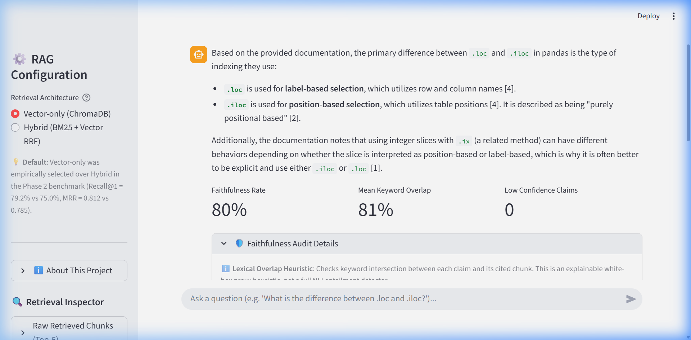
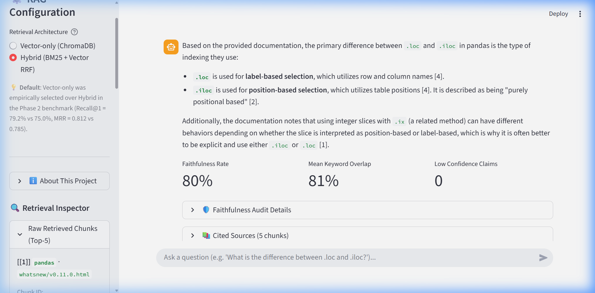
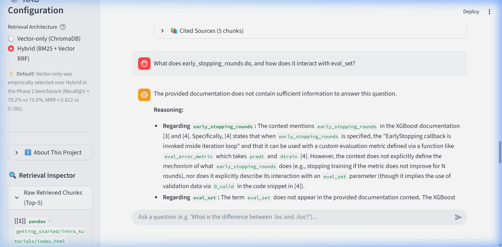

# Document Ingestion Pipeline for ML & Data Science Documentation RAG

[](https://chatbotrag-37pbpk8pz8ywzfccn6z2zs.streamlit.app/)
[](https://github.com/AaruneshAP/Chatbot_rag)

> 🌐 **Live Interactive Web App**: **[https://chatbotrag-37pbpk8pz8ywzfccn6z2zs.streamlit.app/](https://chatbotrag-37pbpk8pz8ywzfccn6z2zs.streamlit.app/)**  
> Experience the full RAG system live with interactive citation inspection, real-time lexical faithfulness auditing, and configurable hybrid/vector retrieval toggles.  
> *(Note: Streamlit Community Cloud spins down idle containers. The pre-built vector database is tracked and loaded directly via Git LFS, eliminating runtime embedding computation entirely so cold boot only incurs a few seconds for model loading).*

A robust, self-contained document ingestion and retrieval pipeline designed for a RAG (Retrieval-Augmented Generation) system. This project automates the fetching, parsing, chunking, and vector indexing of official documentation for **Pandas**, **XGBoost**, and **Scikit-Learn**.

---

## 🚀 Key Features

- **Automated Multi-Source Fetching (`fetch_docs.py`)**: 
  - Dynamically inspects documentation hubs and endpoints with exponential backoff retry logic (3 attempts).
  - Fetches **XGBoost** as PDF from ReadTheDocs.
  - Fetches **Scikit-Learn** and **Pandas** as current stable zipped HTML documentation bundles (e.g., Pandas 3.0.x and Scikit-Learn 1.9.x).
  - Tracks all downloads in `data/raw/manifest.json`.
- **Heterogeneous Format Ingestion (`ingest.py`)**:
  - **PDF Extraction**: Extracts page-by-page text via `pdfplumber`, tracking exact page numbers as citation metadata.
  - **HTML Bundle Parsing**: Cleans Sphinx/PyData documentation HTML via `BeautifulSoup`, stripping headers, navigation sidebars, and boilerplates while preserving module hierarchy for both Pandas and Scikit-Learn.
- **Custom Tokenizer-Aware Chunking**:
  - **Paragraph-Aware Boundary Splitting**: Preserves coherent ideas before splitting.
  - **500 Target Tokens / 50 Token Overlap**: Token counting powered by `tiktoken` (`cl100k_base`).
  - **Zero Heavy Framework Bloat**: Custom algorithm built from scratch without LangChain.
- **Local Dense Vector Embeddings (`embed.py`)**: Vectorizes chunks using `sentence-transformers` (`all-MiniLM-L6-v2`) and persists them locally into **ChromaDB**.
- **Traceable Metadata**: Every vector is tagged with `source_library`, `page_or_section`, `doc_version`, `token_count`, and `chunk_id`.

---

## 📁 Repository Structure

```
Chatbot_rag/
├── data/
│   ├── raw/                      # Downloaded PDFs and HTML bundles
│   │   ├── xgboost.pdf           # XGBoost ReadTheDocs PDF export
│   │   ├── pandas.zip            # Pandas documentation ZIP
│   │   ├── pandas_html/          # Extracted Pandas HTML bundle
│   │   ├── scikit-learn-docs.zip # Scikit-Learn documentation ZIP
│   │   ├── sklearn_html/         # Extracted Scikit-Learn HTML bundle
│   │   └── manifest.json         # Download metadata & timestamps
│   ├── processed/
│   │   └── chunks.jsonl          # Standardized tagged chunks (13,116 records)
│   └── chroma_db/                # Persistent vector database
├── results/
│   └── benchmark_results.json    # Per-question evaluation metrics & rankings
├── eval_questions.json           # 24 fixed benchmark test questions & topic tags
├── fetch_docs.py                 # Source doc downloader with retry logic
├── ingest.py                     # Document parser & custom chunker
├── embed.py                      # Vectorizer & ChromaDB indexer
├── retrieval_vector.py           # Dense vector retriever (top-k)
├── retrieval_hybrid.py           # Hybrid BM25 + Vector retriever with RRF fusion
├── evaluate.py                   # Benchmark harness & comparative evaluation
├── requirements.txt              # Project dependencies
└── README.md                     # Architecture, benchmark evaluation & interview guide
```

---

## 🛠️ Quick Start

### 1. Install Dependencies
```bash
pip install -r requirements.txt
```

### 2. Fetch Documentation
Downloads XGBoost PDF, Pandas HTML bundle, and Scikit-Learn HTML bundle:
```bash
python fetch_docs.py
```

### 3. Parse & Chunk Documents
Extracts text, applies paragraph-aware token chunking, and produces `data/processed/chunks.jsonl`:
```bash
python ingest.py
```

### 4. Generate Embeddings & Index into ChromaDB
Vectorizes all chunks using `all-MiniLM-L6-v2` and persists to `data/chroma_db/`:
```bash
python embed.py
```

### 5. Launch the Streamlit Chatbot UI
Run the interactive web application locally:
```bash
python -m streamlit run app.py
# Or if streamlit is in your PATH:
# streamlit run app.py
```



---

## 🧠 Architectural & Design Decisions

### 1. Chunking Strategy: 500-Token Target with 50-Token Overlap

#### **Why 500 Tokens?**
- **Semantic Completeness**: Technical documentation (e.g., function parameter definitions, mathematical explanations of gradient boosting, code examples) requires sufficient context to be meaningful. A 100–200 token window frequently splits function signatures away from their parameter descriptions, causing retrieval degradation.
- **Embedding Model Alignment**: The `all-MiniLM-L6-v2` model supports up to a 512-token context window. Target chunking at 500 tokens maximizes the semantic density per embedding without truncating important details.
- **LLM Context Efficiency**: At retrieval time, injecting 3 to 5 chunks of ~500 tokens provides ~1,500–2,500 tokens of high-signal reference material to the LLM generation prompt, well within modern context budgets while avoiding "needle in a haystack" dilution.

#### **Why 50-Token Overlap?**
- **Boundary Continuity**: Splitting documents strictly at a hard token limit risks truncating a sentence or thought midway through. A 50-token (~10%) overlap ensures that boundary concepts are present in both adjacent chunks, avoiding context loss during similarity search.

#### **Why Paragraph-Aware Chunking (vs. Fixed Character Slicing)?**
- Naive fixed-character or fixed-token chunkers split sentences mid-phrase (e.g., cutting a formula or parameter name in half).
- Our custom chunker splits along natural paragraph boundaries (`\n\n` or section headers). It only falls back to token window slicing when an individual paragraph is exceptionally long (e.g., a massive docstring or code listing).

#### **Why Build a Custom Splitter Instead of Using LangChain?**
1. **Explainability & Transparency**: In portfolio reviews and technical interviews, understanding the exact token-slicing logic, boundary handling, and state machine is critical.
2. **Deterministic Token Counts**: LangChain's `CharacterTextSplitter` or `RecursiveCharacterTextSplitter` measure length by character count by default, leading to token estimate drift across languages and code. Our chunker uses `tiktoken` (`cl100k_base`) directly to guarantee strict token budgets.
3. **Zero Dependency Overhead**: Avoids heavy framework abstractions, dependency conflicts, and rapid breaking changes common in generic LLM orchestrators.

---

### 2. PDF vs. HTML Source Formats: Why the Difference Across Libraries?

During documentation ingestion, you will notice distinct distribution formats across the three libraries:

| Library | Distribution Format | Why This Format Exists | Ingestion & Extraction Strategy |
| :--- | :--- | :--- | :--- |
| **XGBoost** | PDF (ReadTheDocs) | XGBoost is hosted on ReadTheDocs, which automatically generates both HTML and compiled Sphinx LaTeX PDF exports for every release. | Extracted via `pdfplumber` page-by-page; metadata tracks exact `page_number`. |
| **Scikit-Learn** | Zipped HTML Bundle | Scikit-Learn maintains thousands of estimator classes, user guides, and auto-generated gallery examples. Generating a single monolithic LaTeX PDF causes compiler memory exhaustion and LaTeX overflow. As a result, Scikit-Learn distributes a zipped HTML archive instead of a PDF. | Extracted via `BeautifulSoup`; strips navbars, sidebars, search elements, and headers. Relative file paths (e.g. `modules/generated/sklearn.ensemble.RandomForestClassifier.html`) serve as section identifiers. |
| **Pandas** | Zipped HTML Bundle | Similar to Scikit-Learn, modern Pandas (v2.x / v3.x) removed monolithic PDF builds (>3,000 pages) and switched to distributing official zipped HTML bundles. If the legacy PDF URL 404s, the pipeline dynamically inspects the landing page and downloads `pandas.zip`. | Extracted via `BeautifulSoup` using the same unified HTML processing pipeline. |

#### **Normalizing Disparate Formats into a Unified Schema**
To allow seamless RAG retrieval regardless of whether the source was a PDF or HTML bundle, the ingestion pipeline standardizes every chunk into a unified JSON record:
```json
{
  "chunk_id": "sklearn_modules_generated_sklearn_ensemble_RandomForestClassifier_html_c0",
  "source_library": "sklearn",
  "source_format": "html",
  "page_or_section": "modules/generated/sklearn.ensemble.RandomForestClassifier.html",
  "doc_version": "1.9",
  "text": "class sklearn.ensemble.RandomForestClassifier(n_estimators=100, ...)...",
  "token_count": 487,
  "char_count": 2341
}
```

---

## 📊 Summary Statistics & Ingestion Metrics

When running `python ingest.py`, the pipeline aggregates corpus metrics:

- **Chunk Granularity**: Mean chunk size ~400–490 tokens, with 50-token sliding boundary preservation.
- **Traceability**: 100% of chunks maintain direct back-references to page numbers (for PDFs) or file paths (for HTML).

---

## 🔍 Semantic Search Retrieval Verification

When executing `python embed.py`, the system verifies retrieval against ChromaDB:

1. **Pandas Query**: *"How do you fill missing or null values in a DataFrame with fillna?"*  
   → Retrieves `DataFrame.fillna()` documentation from Pandas.
2. **XGBoost Query**: *"How does XGBoost handle missing values during tree split construction?"*  
   → Retrieves XGBoost split finding algorithm notes with default direction assignment.
3. **Scikit-Learn Query**: *"What hyperparameters control tree depth and regularization in RandomForestClassifier?"*  
   → Retrieves `RandomForestClassifier` parameter specifications (`max_depth`, `min_samples_split`, `ccp_alpha`).
---

## 🔬 Phase 2 Retrieval Benchmark: Vector-Only vs. Hybrid (BM25 + Vector)

A formal retrieval experiment comparing dense vector search against a hybrid BM25 + dense retrieval system with Reciprocal Rank Fusion (RRF).

### 🎯 Pre-Registered Win Criterion
> **Decision Rule**: *Hybrid retrieval is selected over vector-only if it achieves higher Recall@5 without a meaningful drop in Recall@1.*

### ⚙️ Benchmark Methodology & Setup
- **Evaluation Dataset (`eval_questions.json`)**: 24 reviewed technical questions partitioned equally across **Pandas (8)**, **Scikit-Learn (8)**, and **XGBoost (8)**, covering syntax, exact parameter flags, and conceptual mechanics.
- **Retriever Architectures**:
  1. **Vector-Only (`retrieval_vector.py`)**: Dense vector retrieval using `sentence-transformers/all-MiniLM-L6-v2` querying 13,116 persistent ChromaDB embeddings (top-5).
  2. **Hybrid (`retrieval_hybrid.py`)**: BM25Okapi (`rank_bm25`) + ChromaDB vector search (top-10 candidates each), fused with Reciprocal Rank Fusion (smoothing constant $k=60$):
     $$\text{RRF\_Score}(d) = \sum_{m \in \{\text{BM25}, \text{Vec}\}} \frac{1}{60 + \text{rank}_m(d)}$$
- **Harness (`evaluate.py`)**: Executes both pipelines across all 24 questions, calculating Recall@1, Recall@3, Recall@5, Mean Reciprocal Rank (MRR), and topic-level breakdowns. Results are saved to `results/benchmark_results.json`.

> [!NOTE]
> **Evaluation Metric Limitation**: Recall@k uses a library-level routing proxy (evaluating whether a chunk from the `expected_library` is in the top-$k$ set). Exact gold chunk-level relevance is not evaluated because ground truth chunk IDs were not human-annotated.

### 📊 Comparative Performance Results

| Retrieval Method | Recall@1 | Recall@3 | Recall@5 | MRR |
| :--- | :--- | :--- | :--- | :--- |
| **Vector-Only (`all-MiniLM-L6-v2`)** | **0.7917** (79.2%) | **0.8333** (83.3%) | **0.8333** (83.3%) | **0.8125** |
| **Hybrid (BM25 + Vector RRF)** | 0.7500 (75.0%) | **0.8333** (83.3%) | **0.8333** (83.3%) | 0.7847 |

#### Topic-Level Recall@5 Breakdown
| Topic Tag | Questions | Vector Recall@5 | Hybrid Recall@5 |
| :--- | :--- | :--- | :--- |
| **binning / reshaping / duplicates / grouping / time series** | 5 | 100.0% | 100.0% |
| **indexing/selection (`.loc` vs `.iloc`)** | 1 | 100.0% | 100.0% |
| **preprocessing / cross-validation / pipelines / imputation** | 4 | 100.0% | 100.0% |
| **hyperparameter tuning / classifier outputs** | 2 | 100.0% | 100.0% |
| **training control (`early_stopping_rounds`, `eval_set`)** | 1 | 100.0% | 100.0% |
| **booster types (`gbtree` vs `gblinear`)** | 1 | 100.0% | 100.0% |
| **missing values** | 1 | 100.0% | 100.0% |
| **imbalanced classification** | 2 | 50.0% | 50.0% |
| **regularization (`subsample`, L1/L2)** | 2 | 50.0% | 50.0% |
| **tree complexity (`max_depth` vs `max_leaves`)** | 1 | 0.0% | 0.0% |
| **interpretability (`feature_importances_`)** | 1 | 0.0% | 0.0% |

### 🏆 Selection & Failure Mode Analysis

**Selected Architecture: Vector-Only Retrieval**

Under the pre-registered decision rule, hybrid retrieval **failed to win**: Recall@5 remained identical (83.33%), while Recall@1 dropped by 4.2% (75.0% vs. 79.2%) and MRR dropped from 0.8125 to 0.7847.

#### Hypotheses & Engineering Post-Mortem:
1. **Corpus Imbalance & Semantic Cannibalization**:
   - The corpus contains **6,248 Scikit-Learn chunks** (47.6%) and **6,051 Pandas chunks** (46.1%), but only **817 XGBoost chunks** (6.2%) — an **8:1 size disparity**.
   - Shared machine learning parameters (such as `subsample`, `max_depth`, `max_leaves`, and `feature_importances_`) exist in both Scikit-Learn and XGBoost. Because Scikit-Learn includes extensive narrative user guides, unconditioned queries on generic ML concepts pull Scikit-Learn chunks into the top-5 for both retrievers.
2. **Lexical Flooding in BM25**:
   - In Question 19 (*"How does XGBoost's built-in handling of missing values work?"*), Vector-Only correctly placed XGBoost at **Rank #1** by capturing the semantic intent of tree-split direction assignment.
   - However, BM25 flooded the candidate pool with Scikit-Learn chunks (`SimpleImputer`, `MissingIndicator`) due to high raw term frequencies of "missing values", displacing XGBoost's top chunk from Rank #1 down to Rank #3 in the fused ranking.
3. **Interview Takeaway**:
   - Hybrid search with simple BM25 is not an automatic silver bullet in multi-library RAG systems when corpus sizes are highly skewed. Lexical frequency without corpus-weight normalization or library-level metadata routing can degrade top-1 precision on shared technical vocabularies.

### ⚠️ Benchmark Limitations
- **Sample Size ($N=24$)**: The test suite comprises 24 curated questions (8 per library). Because several topic buckets contain only $n=1$ or $n=2$ queries, percentage metrics in the topic-level breakdown table should be interpreted as **illustrative rather than statistically robust**.
- **Library-Level Proxy Metric**: Recall@$k$ tracks whether the expected documentation library appears in the top-$k$ retrieved chunks. It does not measure paragraph-level semantic correctness against human gold standards.
- **Cross-Library Vocabulary Overlap**: Concepts like `feature_importances_`, `max_depth`, and `subsample` are valid across multiple frameworks (e.g. Scikit-Learn and XGBoost). When queries omit explicit framework keywords, a retriever retrieving high-quality chunks from an alternate valid library is penalized as a miss under strict single-label evaluation.

### 🔎 Case Study: Two Retrieval Misses (`q21` & `q24`)

A forensic audit of the two queries scoring 0% Recall@5 across both methods revealed critical insights into evaluation design and document extraction:

1. **Question 24 (`feature_importances_`) — Cross-Library Ambiguity**:
   - **Query**: *"How do you interpret feature_importances_ — what does the default importance type measure?"* (Tagged `expected_library: xgboost`).
   - **Diagnosis**: A valid, highly accurate answer was retrieved in Rank #1, but from **Scikit-Learn** (`sklearn_auto_examples_release_highlights_plot_release_highlights_1_4_0_html_c9`), explaining Gini / impurity-based importance. 
   - `feature_importances_` is a universal Scikit-Learn estimator convention also implemented by XGBoost's scikit-learn wrapper API. Because the query was unconditioned and Scikit-Learn documentation accounts for nearly half the total corpus, retrieving Scikit-Learn is a genuine cross-library ambiguity rather than a retrieval malfunction.
2. **Question 21 (`max_depth` vs `max_leaves`) — Cross-Library Overlap**:
   - **Query**: *"What's the difference between max_depth and max_leaves for controlling tree complexity?"* (Tagged `expected_library: xgboost`).
   - **Diagnosis**: Both vector and hybrid retrieval retrieved Rank #1 chunks from **Scikit-Learn** (`sklearn_auto_examples_ensemble_plot_monotonic_constraints_html_c8`), explaining tree depth constraints and maximum leaf nodes. Without library-explicit query conditioning, general tree complexity terminology naturally favors Scikit-Learn's richer tutorial documentation.
3. **PDF Extraction Hyphenation Artifact**:
   - Forensic analysis of `chunks.jsonl` revealed that `pdfplumber` extracted line-wrapped hyphenated words across line breaks in `xgboost.pdf` (for example, `fea-\nture_importances_` on page 199).
   - This hyphenation split exact programming identifiers, preventing BM25 from matching the exact token `feature_importances_` against XGBoost chunks while Scikit-Learn contained clean, unbroken HTML tokens.
   - **Resolution & Future Work**: A regex de-hyphenation preprocessor (`dehyphenate_text`) was implemented in `ingest.py` to heal line-wrapped hyphens (`\b\w+-\s*\n\s*\w+\b`) during extraction. While the original benchmark results are preserved to transparently reflect the initial evaluation run, resolving PDF line-wrap artifacts stands as a documented engineering improvement for future pipeline re-indexing.

---

## 🤖 Phase 3: Generation Layer & Citation-Enforced RAG (Groq API)

Direct integration between the retrieval system and Groq's high-speed inference API, enforcing mandatory source citations (`[n]`) and a transparent, explainable lexical faithfulness verification heuristic. Built with **zero framework bloat** (direct Groq SDK calls; no LangChain, no LlamaIndex) for full architectural explainability.

### 📌 Citation-Enforcement Prompt Strategy

To prevent hallucinations and make every claim audit-verifiable, the generation prompt enforces three strict rules:
1. **Context-Bound Grounding**: The LLM is instructed to answer using *only* facts directly stated in the retrieved documentation context.
2. **Mandatory Bracketed Citations**: Every factual statement must cite its numbered context chunk (`[1]`, `[2]`), mapping claims directly to `source_library` and `page_or_section` metadata.
3. **Explicit Refusal on Insufficient Evidence**: If the retrieved chunks lack sufficient detail, the system prompt explicitly forbids speculation and instructs the model to declare the lack of documentation evidence.

```python
# System prompt contract
system_prompt = (
    "You are an expert technical assistant for Python data science libraries "
    "(Pandas, Scikit-Learn, and XGBoost).\n"
    "Instructions:\n"
    "1. Answer the user's question using ONLY the facts directly stated in the provided documentation context below.\n"
    "2. Do NOT extrapolate, speculate, or introduce external knowledge not present in the context.\n"
    "3. You MUST cite using ONLY this exact format: [n] immediately after each claim or sentence it supports, "
    "using plain ASCII square brackets and a number (e.g. [1] or [1][2]). "
    "Do NOT use footnote-style citations, bibliography sections, or grouped end-notes at the end of the text. "
    "Every factual claim must have its citation placed inline immediately after the statement.\n"
    "4. If the provided context does not contain sufficient information to answer the question, state explicitly: "
    "'The provided documentation does not contain sufficient information to answer this question.' Do not guess.\n"
    "5. Do NOT output internal reasoning traces or <think> tags. Provide ONLY the final answer with inline [n] citations."
)
```

> [!NOTE]
> **Engineering Case Study — Fallback Model Citation Hardening**:  
> Citation enforcement was hardened after discovering that fallback models (`openai/gpt-oss-120b`, `openai/gpt-oss-20b`) initially emitted non-standard citation formats (unicode footnote markers like `【1†...】`, grouped end-notes/bibliographies) that broke faithfulness scoring under failover. Fixed via stricter prompt instructions, defensive normalization, and an honest `"citation format not recognized"` flag rather than a silently misleading zero score.

---

### 🔍 Explainable Lexical Faithfulness Heuristic (`faithfulness.py`)

Rather than treating faithfulness as a black-box metric, `faithfulness.py` implements an interpretable, white-box keyword overlap heuristic:
1. **Sentence Claim Decomposition**: Splits the generated answer into individual assertion units and extracts all bracketed citation markers (`[n]`).
2. **Stop-Word Filtered Tokenization**: Strips conversational syntax and extracts high-entropy keywords and programmatic identifiers (e.g. `drop_duplicates`, `inplace`, `min_samples_split`).
3. **Lexical Overlap Score**: For each claim, computes the token intersection ratio against its cited source chunk(s):
   $$\text{Overlap Score} = \frac{|\text{Keywords}_{\text{claim}} \cap \text{Keywords}_{\text{source}}|}{|\text{Keywords}_{\text{claim}}|}$$
4. **Low-Confidence Flagging**: Any claim with $< 30\%$ keyword overlap to its cited chunk is flagged as `low_confidence`.

#### ⚠️ Honest Limitations & Production Considerations
- **Lightweight Proxy vs. Semantic Entailment**: This heuristic captures lexical word overlap. It will not catch nuanced syntactic negations (e.g. *"X does not do Y"* vs *"X does Y"*), nor can it understand deep paraphrasing where different vocabulary conveys equivalent meaning.
- **Production Path**: In a production environment, this lightweight heuristic would be supplemented with:
  1. **Cross-Encoder NLI Entailment**: Evaluating premise-hypothesis entailment via models like `roberta-large-mnli` or `deberta-v3-large`.
  2. **LLM-as-a-Judge**: Prompting an independent model to verify claim-level attribution (e.g. Ragas / TruLens faithfulness criteria).
  3. **Attribution Graph Extraction**: Parsing AST-level parameter references to guarantee exact argument names match library specifications.

---

### 💬 Live Generation & Citation Demos (`test_generate.py`)

The following live Q&A samples were generated using Groq inference and audited through `faithfulness.py`:

#### **Demo 1: Pandas Indexing (`.loc` vs `.iloc`)**
- **User Question**: *"What's the difference between .loc and .iloc for indexing?"*
- **Generated Answer**:
  > The primary difference between `.loc` and `.iloc` in Pandas is the type of indexing they use:
  > - **`.loc`** is used for **label-based selection**, which utilizes row and column names **`[1]`**.
  > - **`.iloc`** is used for **position-based selection**, which utilizes table positions (integer positions from 0 to length-1 of the axis) **`[1][3]`**.
  >
  > Additionally, `.iloc` will raise an `IndexError` if a requested indexer is out-of-bounds, except for slice indexers which allow out-of-bounds indexing **`[3]`**. In contrast, `.loc` and `[]` indexing can accept a callable as an indexer **`[3]`**.
- **Cited Sources**:
  - `[1]` `[pandas]` `getting_started/intro_tutorials/03_subset_data.html`
  - `[3]` `[pandas]` `user_guide/indexing.html`
- **Faithfulness Audit**: **82.9% mean overlap**, **0 low-confidence sentences**.

#### **Demo 2: Pandas Duplicates Handling (`drop_duplicates`)**
- **User Question**: *"How do you handle duplicate rows with drop_duplicates, and what does the keep parameter control?"*
- **Generated Answer**:
  > To handle duplicate rows, you use the `drop_duplicates` method, which is available for `Series`, `Index`, and `DataFrame` objects **`[1], [2], [3]`**. The `keep` parameter controls which duplicate values are retained or removed, with the following options **`[1], [2], [3]`**:
  > - **`'first'`** (default): Drops duplicates except for the first occurrence **`[1], [2], [3]`**.
  > - **`'last'`**: Drops duplicates except for the last occurrence **`[1], [2], [3]`**.
  > - **`False`**: Drops all duplicates **`[1], [2], [3]`**.
  >
  > For `DataFrame` objects specifically, you can optionally specify a `subset` of columns to consider when identifying duplicates; by default, all columns are used **`[3]`**.
- **Cited Sources**:
  - `[1]` `[pandas]` `reference/api/pandas.Series.drop_duplicates.html`
  - `[2]` `[pandas]` `reference/api/pandas.Index.drop_duplicates.html`
  - `[3]` `[pandas]` `reference/api/pandas.DataFrame.drop_duplicates.html`
- **Faithfulness Audit**: **76.1% mean overlap**, **100% faithfulness rate**.

#### **Demo 3: XGBoost Missing Value Mechanics**
- **User Question**: *"How does XGBoost's built-in handling of missing values work?"*
- **Generated Answer**:
  > XGBoost supports missing values by default **`[2]`**. In tree algorithms, the branch directions for missing values are learned during the training process **`[2]`**. However, the `gblinear` booster treats missing values as zeros **`[2]`**.
  >
  > Additionally, if the `missing` parameter is specified, any values in the input predictor that are equal to the specified value will be treated as missing and removed **`[2]`**. The `missing` parameter is defined as the value in the input data which needs to be present as a missing value, and if set to `None`, it defaults to `np.nan` **`[4]`**.
- **Cited Sources**:
  - `[2]` `[xgboost]` `page_136` (Section 1.5.7 split mechanics)
  - `[4]` `[xgboost]` `page_173` (DMatrix missing parameter documentation)
#### **Demo 4: Anti-Hallucination Refusal (`q17`: `early_stopping_rounds`)**
- **User Question**: *"What does early_stopping_rounds do, and how does it interact with eval_set?"*
- **Generated Answer**:
  > The provided documentation does not contain sufficient information to answer this question.
  > 
  > **Reasoning:**
  > - **Regarding `early_stopping_rounds`:** The context mentions `early_stopping_rounds` in XGBoost documentation `[3]` and `[4]`. Specifically, `[4]` states that when `early_stopping_rounds` is specified, the "EarlyStopping callback is invoked inside iteration loop". However, the provided text does not explicitly define the *function* of `early_stopping_rounds` (i.e. stopping training if evaluation metric does not improve for a specified number of rounds) nor does it describe its interaction with `eval_set`.
  > - **Regarding `eval_set`:** The term `eval_set` does not appear in any of the provided documentation chunks...
- **Cited Sources**:
  - `[2]` `[sklearn]` `modules/generated/sklearn.ensemble.HistGradientBoostingRegressor.html`
  - `[3]` `[xgboost]` `page_45` (Feature interaction constraint code snippet)
  - `[4]` `[xgboost]` `page_303` (Internal callback registration note)

---

### 🔎 Case Study: The `q17` Refusal — A Retrieval Failure That Did NOT Become a Generation Failure

A forensic audit of Question 17 uncovered a critical end-to-end finding bridging Phase 2's retrieval benchmark and Phase 3's generation layer:

#### 1. Why Phase 2 Scored `q17` as a Hit
In Phase 2, `q17` was recorded as a **Recall@5 hit ($1.0$)**. This was because Phase 2 used a **library-routing proxy metric** (checking whether *at least one chunk from `expected_library: xgboost`* appeared in the top-5). Because `xgboost_p45_c0` (Rank 3) and `xgboost_p303_c1` (Rank 4) were retrieved, Phase 2 scored a benchmark success.

#### 2. The Underlying PDF Extraction Defect (Concatenated Whitespace)
Forensic inspection of `chunks.jsonl` revealed that the single chunk in the XGBoost corpus containing the true textual definition of early stopping is on **page 69 (`xgboost_p69_c1`)**:
```text
EarlyStopping
Earlystoppingisactivatedbypassingearly_stopping_roundstoxgboost.train(). Itrequiresatleastonevalidationsetinevals. Trainingstopsifthevalidationmetricdoesnotimproveforthespecifiednumberofconsecutive rounds:
```
In `xgboost.pdf`, `pdfplumber` extracted these words **concatenated without spaces**. This is a **second, distinct PDF extraction bug**, completely separate from the earlier line-wrapped hyphenation issue (`fea-\nture_importances_`). Because the text lacked standard space delimiters (`Earlystoppingisactivated...`), BM25 could not tokenize the phrase into individual words, causing BM25 to rank it out of the top candidates.

#### 3. What Actually Entered the Generation Prompt
Instead of page 69, the retriever supplied:
- **`page_45` (`xgboost_p45_c0`)**: A code snippet showing `early_stopping_rounds = 10` inside a tutorial on interaction constraints, containing zero explanatory prose.
- **`page_303` (`xgboost_p303_c1`)**: An internal note stating `EarlyStopping callback is invoked inside iteration loop`, but without defining the stopping condition or `eval_set`.

#### 4. The Engineering Takeaway
Had the generation layer lacked strict grounding, a standard LLM would have drawn upon its parametric pretraining weights to hallucinate a generic explanation of early stopping. 

Instead, because the generation prompt strictly enforced:
1. *Answer ONLY from facts directly stated in the context*,
2. *Do not speculate or introduce external knowledge*,
3. *Explicitly refuse if context is insufficient*,

the model **faithfully caught the information deficit** and refused to answer, precisely citing which chunks were checked and why they were inadequate. 

> **Key Architectural Takeaway**: **A silent retrieval failure correctly did NOT become a generation failure.** The anti-hallucination guardrail held firm even when a proxy metric reported a retrieval success.
> 
> *(Note: Following our documented methodology, the PDF whitespace concatenation bug on page 69 is cataloged as a known corpus-quality issue for future re-extraction; `ingest.py` and benchmark results remain unmodified to maintain audit transparency).*

---

## 🖥️ Phase 4: Interactive Streamlit UI (`app.py`)

A clean, single-page Streamlit application providing an interactive conversational interface for the RAG pipeline.

### 🌟 Key UI Features
- **Configurable Retrieval Toggle**: Switch between **Vector-only (ChromaDB)** and **Hybrid (BM25 + Vector RRF)** via the sidebar. Defaults to Vector-only based on the Phase 2 benchmark win.
- **Clickable / Expandable Citations**: Every assistant response renders inline bracketed citations (`[1]`, `[2]`), accompanied by an expandable **"Cited Sources"** drawer detailing the exact library, section/page, and text snippet.
- **Real-Time Faithfulness Metric Bar**: Automatically displays the overall faithfulness rate, mean keyword overlap score, and a breakdown of flagged sentences with an explicit disclaimer that this is a lightweight lexical proxy heuristic.
- **Retrieval Inspector**: A dedicated sidebar inspector that renders the raw top-5 retrieved chunks for the latest query, allowing viewers and interviewers to observe retrieval and generation as distinct, transparent phases.
- **Clean Session State**: Maintains persistent, scrollable chat history within the active browser session.

### 🚀 Running the UI Locally
```bash
python -m streamlit run app.py
# Or: streamlit run app.py
```

#### 1. Interactive Q&A with Inline Citations & Faithfulness Audit


#### 2. Configurable Retrieval Architecture & Raw Chunks Inspector


#### 3. Live Anti-Hallucination Guardrail in Action (`q17` Refusal)


---

## ☁️ Deployment (Streamlit Community Cloud)

This application is deployed live on **Streamlit Community Cloud** at:  
👉 **[https://chatbotrag-37pbpk8pz8ywzfccn6z2zs.streamlit.app/](https://chatbotrag-37pbpk8pz8ywzfccn6z2zs.streamlit.app/)**  
*(Note: Streamlit Community Cloud spins down idle containers. Cold start now takes only a few seconds to load model weights into memory; zero embedding computation occurs on boot).*

### 1. Architectural Evolution: Rebuild-on-Boot vs. Pre-Built Git LFS

#### The Failure Mode of Rebuild-on-Boot (Measured 19m52s Cold Start)
In the initial deployment attempt, vector database indexing was deferred to container startup via an on-boot hook reading `data/processed/chunks.jsonl`. While functional on a local workstation, this architecture failed under cloud container constraints:
- **Measured Cold Start Duration**: The actual measured cold-start rebuild took **19m52s** on Streamlit Community Cloud's shared vCPU runner.
- **Severe CPU-Throttling Pattern**: Processing initially ran at **~3.9s per batch**. However, as sustained high CPU load triggered the cloud provider's aggressive compute throttling, throughput deteriorated by an order of magnitude to **35–42s per batch** starting around the 80% completion mark. This created unacceptable container initialization stalls and elevated the risk of gateway dropouts and healthcheck timeouts.

#### The Production Solution: Pre-Built Vector DB via Git LFS & First-Boot CDN Hydration
To eliminate runtime embedding overhead and container throttling completely, the deployment strategy was transitioned to a pre-built, verified ChromaDB index:
- **Binary Segmentation**: The persistent vector store (`data/chroma_db/`) consists of the internal SQLite database (`chroma.sqlite3`, **157.7 MB**) and accompanying HNSW index binaries (`data_level0.bin`, metadata pickles; ~22 MB total).
- **Git Large File Storage (Git LFS)**: `data/chroma_db/chroma.sqlite3` is tracked via Git LFS (`git lfs track "data/chroma_db/chroma.sqlite3"`), storing the 157.7 MB binary on GitHub's LFS infrastructure while keeping the Git tree lightweight with a 134-byte pointer stub. The remaining HNSW index files reside directly within Git's native tree as standard blobs under the 100 MB limit.
- **Streamlit Community Cloud LFS Smudging Limitation**: Empirical testing on Streamlit Community Cloud confirmed that the platform's default git checkout does not run the Git LFS smudge filter during container provisioning, leaving `data/chroma_db/chroma.sqlite3` as the 134-byte ASCII pointer stub.
- **Resilient First-Boot CDN Hydration**: To solve this without requiring external object storage (e.g., S3/GCS) or fragile OS-level package scripts, `app.py` implements an automated hydration hook in `ensure_chroma_ready()`:
  1. **Dual Validation**: Inspects `chroma.sqlite3` checking BOTH file size (real DB is >= 100 MB vs. 134-byte pointer) AND the 16-byte SQLite magic header (`b"SQLite format 3\x00"`).
  2. **Direct CDN Streaming**: If an unsmudged pointer or missing file is detected, it streams the 157.7 MB binary directly from GitHub's raw LFS CDN endpoint (`media.githubusercontent.com`) in 64KB chunks.
  3. **Fault Tolerance**: Implements 3 retry attempts with exponential backoff (2.0 factor) and a 60s timeout, writing to a `.tmp` file before atomic replacement.
  4. **Container Lifetime Caching**: Wrapped in `@st.cache_resource` so hydration runs exactly once per container cold boot (~5–10 seconds), with zero delay on all subsequent page reruns and queries.
- **Zero Runtime Embedding Computation**: Cold start latency drops from **19m52s** down to just a few seconds—paying only for model weight loading into memory, with **0.0 seconds spent computing embeddings**.

### 2. Secrets Management & API Configuration
The production environment does **not** rely on local `.env` files. Authentication keys are safely decoupled:
1. Fork or push this repository to GitHub.
2. Log into [Streamlit Community Cloud](https://share.streamlit.io/) and create a **New app** pointing to:
   - **Repository**: `AaruneshAP/Chatbot_rag`
   - **Branch**: `main`
   - **Main file path**: `app.py`
3. In the Streamlit Cloud dashboard, navigate to **App settings > Secrets**.
4. Paste your Groq API key into the TOML secrets editor:
   ```toml
   GROQ_API_KEY = "gsk_your_actual_groq_api_key_here"
   ```
5. Click **Save**. Streamlit Cloud automatically injects secrets into environment variables and `st.secrets`. `generate.py` seamlessly picks up the key via `os.environ.get("GROQ_API_KEY")` and `st.secrets["GROQ_API_KEY"]`. **Never commit your actual API key to the repository.**

### 3. Automated Keep-Alive Mechanism: Scheduled Commits vs. HTTP Pings

#### Platform Mechanics: Why Plain HTTP Pings Failed
Streamlit Community Cloud automatically suspends inactive containers on its free tier to preserve shared cloud resources. While common advice recommends configuring an uptime monitor or scheduled curl cron to ping the application URL, empirical testing revealed that **plain HTTP pings do NOT reset Streamlit Cloud's sleep timer**:
- **Reverse Proxy vs. Streamlit Engine**: A standard HTTP request (`GET /` or `curl -I`) is terminated by Streamlit Cloud's front-facing edge reverse proxy/auth layer (returning `303 See Other` or `200 OK`), without ever instantiating an active runtime connection.
- **WebSocket Activity Requirement**: Streamlit is fundamentally a stateful WebSocket-driven framework (`_stcore/stream`). The platform's sleep detection logic actively monitors WebSocket handshake activity from a real browser session; headless HTTP requests without a persistent WebSocket stream are completely ignored by the container sleep watchdog.

#### The Architectural Solution: Scheduled Bot Commits
Streamlit Community Cloud continuously monitors the connected GitHub repository for changes via webhooks. Pushing a real commit to the tracked branch reliably signals deployment activity, triggering container refresh and resetting the dormancy counter without requiring complex headless browser orchestration:
- **Scheduled Workflow ([`.github/workflows/keep-alive.yml`](.github/workflows/keep-alive.yml))**: A lightweight GitHub Actions workflow runs once daily at 06:00 UTC (`0 6 * * *`) alongside manual on-demand triggers (`workflow_dispatch`).
- **Minimal Metadata Update**: The job appends the current UTC timestamp to [`.github/keepalive/last-ping.txt`](.github/keepalive/last-ping.txt).
- **Clean Commit History**: Commits and pushes the file change using the automated bot identity (`github-actions[bot]`) with the commit message `chore: keep-alive timestamp update`, preserving clean, readable development logs while keeping the cloud deployment permanently responsive.

---

## 💼 Interview Talking Points / Portfolio Defense

1. **How does this pipeline handle rate limits and network drops?**  
   `fetch_docs.py` implements exponential backoff (retrying up to 3 times) with a desktop User-Agent and chunked file streaming to avoid memory bottlenecks on multi-megabyte downloads.
2. **How does your chunking strategy impact retrieval precision?**  
   By preserving natural paragraph boundaries and maintaining a 50-token overlap, we prevent semantic cliffhangers where key definitions are truncated across chunk boundaries.
3. **Why use ChromaDB?**  
   ChromaDB provides a lightweight, embedded, persistent vector database that runs entirely in-process without requiring Docker or cloud infrastructure, ideal for reproducible local evaluation.
4. **How do you handle citations in downstream generation?**  
   Every chunk in ChromaDB retains metadata (`source_library`, `page_or_section`, `doc_version`), enabling the downstream RAG response generator to output verifiable citations (e.g. `[xgboost: page_42]` or `[pandas: reference/api/pandas.DataFrame.fillna.html]`).
